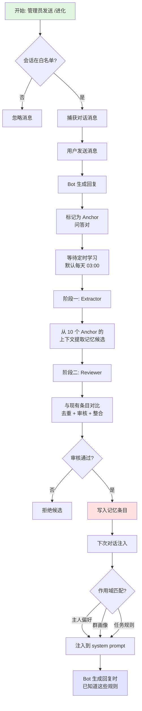

# 小本本记下来

一个让 AstrBot 能够**持续学习和记住**的成长记忆插件。

## 核心特性

### 主人即时指令快速通道 ✨

主人使用强意图词（"以后/永远/记住/不要再/必须/禁止"）的明确指令会**跳过审核流程，立即生效**：

```
用户: "记住，以后画图不要偏黄"
Bot: 好的，规则已保存
```

- 工具返回简短确认信息，由对话 LLM 生成自然回复

- 适用于 `owner` / `task` / `global` 层级的 `behavior_rule`
- 信任级别自动设为 `owner_explicit`
- 写入后立即刷新内存快照，下一轮对话生效
- 普通审核流程仍保留，用于非强意图的学习

### 情感记忆支持 💭

新增 `emotional_bond` 条目类型，支持短期情感记忆：

```json
{
  "kind": "emotional_bond",
  "scope": "owner",
  "content": "主人最近工作压力很大，需要主动关心",
  "expires_in_days": "7"
}
```

- 可设置 `expires_in_days` 参数（0 = 永久，> 0 = N 天后自动归档）
- 每 5 分钟自动清理过期条目
- 适用于临时情绪、短期状态等需要时效性的记忆

### 与 context_aware 插件协同

- **growth_memory**: 长期记忆（主人偏好、群画像、固定规则）
- **context_aware**: 短期上下文（最近发言人、话题连续性）
- `context_aware` 可检测短期信号 → 触发 `growth_memory_note` 工具写入 `emotional_bond` + 7 天过期

---

## 这是什么？

"小本本记下来"是一个面向 AstrBot 的个人成长记忆插件，让你的 Bot 能够在**你明确授权的 QQ 会话**中：

- 📝 **记住你的偏好**：比如"画图不要用黄调"、"我不喜欢冗长的回复"
- 🎯 **积累工作经验**：比如"某个 API 经常超时，需要重试 3 次"
- 👥 **理解群聊氛围**：比如"这个群是技术讨论群，不要发表情包"
- 🧑 **认识群里的人**：比如"老张是 QQ 号 888888，是项目负责人"
- 💭 **短期情感记忆**：比如"主人最近压力大，需要主动关心"（7 天后自动过期）

**不会做的事**：
- ❌ 在未授权的群/私聊采集任何内容（默认白名单为空）
- ❌ 自动改写 Bot 的核心人格设定
- ❌ 记住敏感信息（密码、API Key、Token）
- ❌ 从普通群友的发言中生成全局行为规则

---

## 工作原理



### 核心流程说明

1. **显式授权**：只在发送 `/进化` 的 QQ 私聊/群聊中工作
2. **自动捕获**：记录对话消息和 Bot 回复（称为 Anchor）
3. **定时学习**：每天定时（默认凌晨 3 点）批量处理
   - **Extractor**：从对话上下文中高召回提取记忆候选
   - **Reviewer**：与现有条目比对，过滤重复和低质量候选
4. **条目注入**：按作用域和优先级注入到 Bot 的 system prompt
5. **持续迭代**：随着对话积累，记忆条目不断更新和完善

---

## 快速开始

### 1. 安装

将插件目录放到 AstrBot 的插件目录，保持目录名为 `astrbot_plugin_growth_memory`。

插件无需额外依赖，AstrBot 4.24+ 可直接加载。

### 2. 必要配置

打开 AstrBot 插件配置页面，找到"小本本记下来"插件：

#### 2.1 配置主人身份

```json
{
  "owner_identities": ["aiocqhttp:你的QQ号"]
}
```

**格式说明**：`aiocqhttp:QQ号` 或 `aiocqhttp:user:QQ号`

**作用**：主人身份拥有最高权限，可以：
- 提交全局规则、任务规则和主人专属偏好
- 管理学习目标和记忆条目
- 普通群友只能提交关于自己的个人画像

#### 2.2 选择学习模型

| 配置项 | 说明 |
|--------|------|
| `extractor_provider_id` | 第一阶段：提取记忆候选 |
| `reviewer_provider_id` | 第二阶段：审核和整合（留空则复用 Extractor） |

**从下拉列表选择**：插件会自动读取 AstrBot 已配置的 Chat Provider，无需重复填写 API Key。

#### 2.3 可选配置（有默认值）

| 配置项 | 默认值 | 说明 |
|--------|--------|------|
| `capture_enabled` | `true` | 全局捕获开关（白名单为空时仍不会捕获） |
| `llm_note_enabled` | `true` | 允许聊天 LLM 调用 `growth_memory_note` 工具主动提交记忆候选 |
| `daily_request_budget` | `64` | 每日学习请求上限 |
| `daily_input_token_budget` | `1000000` | 每日输入 Token 估算上限 |
| `daily_output_token_budget` | `1000000` | 每日输出 Token 硬上限 |
| `injection_token_budget` | `800` | 单轮记忆注入 Token 上限 |

### 3. 开启学习

在需要学习的 QQ 私聊或群聊中发送：

```
/进化
```

**回复示例**：
```
已开启当前会话学习: aiocqhttp:*:group:123456789
```

**停止学习**：
```
/停止进化
```

**查看状态**：
```
/进化状态
```

**状态示例**：
```
📊 学习状态

🎯 当前会话: 已开启
📝 已学到: 12 条记忆

  └ 主人规则: 5 条
  └ 任务规则: 4 条
  └ 群画像: 3 条

💭 当前生效的记忆:
  [主人规则] 画图不要用黄调滤镜
  [主人规则] 回复保持简洁
  [任务规则·画图] 避免复古风格

📊 注入统计: 3 条, 245 tokens

⏰ 下次学习: 每天 03:00
📦 待学习: 8 个对话
✅ 运行正常
```

**注意**：这三个命令需要 AstrBot 管理员权限。

---

## 核心概念

### 记忆作用域 (Scope)

记忆条目按作用域分类，注入时按优先级匹配：

| 作用域 | 适用范围 | 优先级 | 示例 |
|--------|----------|--------|------|
| `owner` | 主人专属 | ⭐⭐⭐⭐⭐ | "我喜欢简洁的回复" |
| `group` | 特定群聊 | ⭐⭐⭐⭐ | "这个群禁止讨论政治" |
| `person` | 特定用户 | ⭐⭐⭐ | "老张（QQ:888888）是项目负责人" |
| `task` | 特定任务 | ⭐⭐ | "画图时不要用黄调滤镜" |
| `global` | 全局规则 | ⭐ | "工具调用失败时不要重复尝试" |

**注入规则**：
- 单轮对话最多注入 800 Token（可配置）
- 按优先级从高到低选择条目
- 同一优先级内，按 `priority` 字段排序

### 条目类型 (Kind)

| 类型 | 说明 | 示例 |
|------|------|------|
| `behavior_rule` | 行为规则 | "画图不要用复古滤镜" |
| `profile_fact` | 画像事实 | "主人是全栈开发者，主要用 Go 和 Vue" |
| `milestone` | 重要经历 | "2026-08-09 完成了用户认证模块重构" |
| `emotional_bond` | 情感记忆 | "主人最近压力大，需要主动关心"（支持过期） |

### 信任等级 (Trust Level)

| 等级 | 说明 | 如何获得 |
|------|------|----------|
| `manual` | 手工条目 | WebUI 手动创建 |
| `owner_explicit` | 主人明确指示 | 主人说"记住..." |
| `owner_correction` | 主人纠正 | 主人说"不对，应该..." |
| `repeated_observation` | 重复观察 | 同一偏好出现 3+ 次且跨 2+ 天 |
| `model_inference` | 模型推断 | Reviewer 从对话推断 |

**自动学习策略**：
- 主人画像至少 3 条且跨 2 天才能从 `draft` 进入 `trial`
- 自动学习不能改写 `manual` 条目
- 普通群友不能提交 `behavior_rule`

### 条目状态 (Status)

| 状态 | 说明 | 是否注入 |
|------|------|----------|
| `draft` | 草稿 | ❌ |
| `trial` | 试用 | ✅ |
| `active` | 活跃 | ✅ |
| `suspended` | 暂停 | ❌ |
| `archived` | 归档 | ❌ |

**自动清理**：
- 草稿状态超过 90 天自动归档
- 过期条目最多 5 分钟退出运行态

---

## 学习管线详解

### Anchor（问答锚点）

每次用户触发 Bot 回复时，系统会创建一个 Anchor：

```
Anchor = {
  问题: 用户的消息,
  上文: 问题前 10 条消息,
  回答: Bot 的最终回复,
  下文: 回答后 10 条消息
}
```

### 两阶段学习

#### 阶段一：Extractor（提取器）

- **输入**：最多 10 个 Anchor 的完整上下文
- **任务**：高召回提取所有可能的记忆候选
- **输出**：记忆候选列表（JSON 格式）
- **约束**：
  - 单批最多 4,000 估算 Token
  - 必须引用真实消息 ID 作为证据
  - 重叠窗口自动去重

#### 阶段二：Reviewer（审查器）

- **输入**：
  - Extractor 的候选列表
  - 原始对话证据
  - 现有记忆条目
- **任务**：
  - 与现有条目对比去重
  - 验证证据真实性
  - 评估候选质量
  - 整合或拒绝候选
- **输出**：最终决策（接受/拒绝/修改）

**证据链保证**：
- Extractor 和 Reviewer 必须引用当前窗口内真实消息 ID
- 证据按消息去重，不会因重叠窗口虚增计数
- 跨批次的证据累积需要跨天验证

### 定时执行

默认每天 **03:00 (Asia/Shanghai)** 自动学习，可在 WebUI 中管理时间表：

- 最多配置 8 个时间点
- 支持时区设置
- 可单独启用/停用

**手动触发**：在 WebUI 的"运行设置"中点击"立即运行"。

---

## WebUI 管理界面

插件启动后，访问 AstrBot 控制台 → 插件详情 → "小本本记下来" Page，可以：

### 学习目标管理
- 查看所有已授权的 QQ 会话
- 添加/删除/启用/停用学习目标
- 查看每个目标的统计信息

### 记忆条目管理
- 查看所有记忆条目
- 按作用域、类型、状态筛选
- 编辑条目内容
- 查看条目的历史版本
- 回滚到任意历史版本

### 运行设置
- 配置主人身份
- 选择 Extractor 和 Reviewer 模型
- 设置预算上限
- 查看实时预算消耗

### 学习时间表
- 添加/删除学习时间点
- 设置时区
- 启用/停用时间点

### 审计记录
- 查看最近 50 次学习运行
- 查看条目变更历史
- 导出审计日志

---

## 进阶使用

### 1. 主动记忆工具（实验性）

开启 `llm_note_enabled` 后，聊天 LLM 可以调用 `growth_memory_note` 工具主动提交记忆候选：

**用户说**：
```
记住，我不喜欢冗长的回复，越简洁越好。
```

**LLM 调用**：
```python
growth_memory_note(
    note="主人偏好简洁的回复风格，避免冗长说明",
    scope="owner",
    kind="profile_fact",
    confidence=0.95
)
```

**返回**：
```
已记录为待审核记忆候选 a1b2c3d4e5f6, 将在下一次学习批次交给 Reviewer 筛选, 尚未写入正式记忆.
```

**工具参数**：

| 参数 | 类型 | 说明 | 可选值 |
|------|------|------|--------|
| `note` | string | 用一句可执行、可验证的话概括要记住的内容 | 1-1000 字符 |
| `scope` | string | 记忆层级 | `owner`, `global`, `task`, `group`, `person` |
| `kind` | string | 条目类型 | `behavior_rule`, `profile_fact`, `milestone` |
| `subject_id` | string | person 层级对应的 QQ 号 | 留空表示当前说话的人 |
| `triggers` | string | task 层级触发词（逗号分隔） | 其他层级可留空 |
| `confidence` | number | 初始置信度 | 0.0 - 1.0 |

**权限限制**：
- 普通群友不能提交 `owner`、`global`、`task` 层级
- 普通群友不能提交 `behavior_rule` 类型
- 只有主人可以提交全局规则

### 2. 手动创建条目

在 WebUI 的"记忆条目"页面点击"新建条目"：

**示例：画图规则**
```json
{
  "scope_type": "task",
  "scope_key": "drawing",
  "kind": "behavior_rule",
  "content": "画图时不要使用黄调滤镜和复古风格",
  "triggers": ["画图", "画画", "绘图", "生成图片"],
  "trust_level": "manual",
  "status": "active",
  "priority": 100
}
```

**示例：群画像**
```json
{
  "scope_type": "group",
  "scope_key": "aiocqhttp:group:123456789",
  "kind": "profile_fact",
  "content": "这是一个技术讨论群，成员都是后端开发者，主要讨论 Go 和微服务架构",
  "trust_level": "manual",
  "status": "active"
}
```

### 3. 预算控制

为防止 API 成本失控，插件提供多层预算保护：

| 预算类型 | 默认值 | 说明 |
|----------|--------|------|
| 每日请求数 | 64 | 包括 Extractor 和 Reviewer 的总请求数 |
| 每日输入 Token | 1,000,000 | 估算值，可能与实际略有偏差 |
| 每日输出 Token | 1,000,000 | 精确值，来自 API 返回 |
| 单次输入上限 | 32,000 | 单次 Extractor/Reviewer 请求的最大输入 |
| 单次输出上限 | 32,768 | 单次 Extractor/Reviewer 请求的最大输出 |

**超出预算后**：
- 当日学习自动暂停
- 次日零点重置预算
- 已捕获的 Anchor 不会丢失，等待下次学习

**查看预算消耗**：在 WebUI 的"运行设置"页面实时查看。

### 4. 容错与降级

#### 有界队列保护
- 捕获队列容量：2048（可配置）
- 队列满时：优先保留 Anchor 问答对，暂停捕获普通消息
- 学习暂停时：不阻塞聊天，已捕获数据保留

#### 失败重试
- 单次 Provider 超时：45 秒
- 即时重试：1 次
- 连续失败：触发 30 分钟 Circuit Breaker

#### 自动清理
- 原始消息默认保留 14 天
- 未完成 Anchor 的问答不按普通 TTL 删除
- 超过 2 小时未产生回答的 Anchor 自动取消

---

## 隐私与安全

### 数据存储

所有数据存储在本地 SQLite 数据库：

```
<AstrBot 数据目录>/data/astrbot_plugin_growth_memory/growth_memory.db
```

**包含的数据**：
- 对话消息（脱敏后）
- 记忆条目
- 学习运行记录
- 审计日志

**不包含**：
- 图片、语音、视频的二进制内容
- 完整的 system prompt 和工具调用结果
- Access Token、密码等凭据

### 敏感信息过滤

插件自动拒绝包含以下内容的记忆候选：

- `api key`, `apikey`, `password`, `passwd`
- `access token`, `refresh token`
- `secret key`, `private key`
- `-----BEGIN` (私钥特征)
- `sk-[a-z0-9_-]{12,}` (OpenAI API Key 格式)
- `ignore previous instructions` (提示词注入)

### 审计追踪

所有条目变更都会记录审计日志：

```json
{
  "actor_key": "admin",
  "action": "save",
  "resource_type": "entry",
  "resource_id": "entry-uuid",
  "context": {"version": 2},
  "created_at": "2026-08-09T10:30:00Z"
}
```

可在 WebUI 查看，支持导出。

---

## 常见问题

### Q: 为什么不直接用世界书插件？

**A**: 世界书适合**静态设定**（人物、世界观），本插件专注**动态学习**（偏好、经验）。两者互补，不冲突。

| 维度 | 世界书 | 成长记忆 |
|------|--------|----------|
| 内容来源 | 手工编写 | 自动学习 |
| 更新频率 | 偶尔修改 | 持续迭代 |
| 适用场景 | 固定设定 | 个人偏好、群画像 |
| 作用域 | 关键词触发 | 多层级匹配 |

### Q: 和 LivingMemory 插件有什么区别？

**A**: LivingMemory 记录"**发生过什么**"（情节、事实），本插件记录"**以后怎么做**"（规则、偏好）。

| 维度 | LivingMemory | 成长记忆 |
|------|--------------|----------|
| 记忆类型 | 情节记忆 | 规则记忆 |
| 召回方式 | 向量相似度 | 作用域匹配 |
| 典型内容 | "上周讨论过 XX 功能" | "画图不要用黄调" |
| 更新方式 | 每轮反思 | 定时批量学习 |

**推荐搭配使用**。

### Q: 学习会消耗很多 API Token 吗？

**A**: 有多层预算保护，默认配置下：

- **每日最多**：64 次请求 + 2M Token（1M 输入 + 1M 输出）

可根据实际需求调整预算。建议从小预算开始，观察效果后逐步放开。

### Q: 普通群友能修改 Bot 的行为规则吗？

**A**: **不能**。权限严格限制：

| 角色 | 可提交的作用域 | 可提交的类型 |
|------|----------------|--------------|
| 主人 | 全部 | 全部 |
| 普通群友 | `person`（仅关于自己） | `profile_fact`, `milestone` |

普通群友**不能提交**：
- `global`、`owner`、`task` 作用域
- `behavior_rule` 类型

### Q: 如何回滚错误的记忆条目？

**A**: 在 WebUI 的"记忆条目"页面：

1. 找到目标条目，点击"历史版本"
2. 查看所有历史版本
3. 选择要回滚的版本，点击"回滚"
4. 系统会创建新版本，内容为选中的历史版本

**注意**：回滚会创建新版本，不会删除历史记录。

### Q: 关闭学习后，已有的记忆会失效吗？

**A**: **不会**。关闭学习只停止新的捕获，已有条目仍然会按作用域注入。

如需停止注入，需要手动将条目状态改为 `suspended` 或 `archived`。

### Q: 为什么学习时间默认是凌晨 3 点？

**A**: 原因：
1. **错峰**：避免白天高峰时段占用 API 配额
2. **证据充分**：当天的对话已基本结束
3. **不打扰**：不影响用户使用

可在 WebUI 自由调整，支持多个时间点。

### Q: Extractor 和 Reviewer 可以用不同的模型吗？

**A**: **可以**。推荐策略：

| 阶段 | 推荐模型 | 原因 |
|------|----------|------|
| Extractor | Claude Sonnet / GPT-4 | 高召回，成本适中 |
| Reviewer | Claude Opus / GPT-4 | 高精度，最终把关 |

也可以两阶段用同一个模型，留空 `reviewer_provider_id` 即可。

### Q: 插件会影响聊天速度吗？

**A**: **几乎不会**。设计原则：

- **捕获**：异步入队，不阻塞聊天
- **注入**：只读内存快照，不查询数据库
- **学习**：定时批量执行，不在聊天热路径

Token 估算和作用域匹配都在毫秒级完成。

---

## 开发与测试

### 运行测试

```bash
PYTHONPATH=.. python3 -m unittest discover -s tests -v
```

**测试覆盖**：
- 65 项单元测试和集成测试
- 2,000 条消息的 writer 压力测试
- 40 个关键事件的并发场景
- AstrBot 4.26.8 完整生命周期检查

### 代码检查

```bash
ruff check .
ruff format --check .
python3 -m compileall -q .
```

### 兼容性

| 组件 | 最低版本 | 推荐版本 |
|------|----------|----------|
| AstrBot | 4.24.0 | 4.26.8+ |
| Python | 3.10 | 3.11+ |
| SQLite | 3.35.0 | 3.40.0+ |

**依赖**：无第三方依赖，只使用 Python 标准库。

---

## 设计文档

更详细的技术设计和实现规格，请参阅：

- [技术设计文档](docs/TECHNICAL_DESIGN.md) - 架构、边界、信任模型
- [工程实施规格](docs/IMPLEMENTATION_SPEC.md) - DDL、API、状态机
- [定时学习管线规格](docs/SCHEDULED_LEARNING_PIPELINE.md) - 调度、窗口、两阶段 LLM
- [验证记录](docs/VALIDATION.md) - 测试证据和部署检查
- [变更记录](CHANGELOG.md) - 版本历史

---

## 许可与贡献

**许可证**：MIT License

**作者**：木有知

**仓库**：https://github.com/muyouzhi6/astrbot_plugin_growth_memory

**问题反馈**：欢迎在 GitHub Issues 提交 Bug 报告和功能建议。

**贡献指南**：欢迎 Pull Request！请确保：
- 通过所有现有测试
- 添加新功能的测试覆盖
- 遵循现有代码风格（ruff）

---

## 致谢

本插件的设计参考了：
- `@ivangdavila/self-improving` - 显式纠错优先、分层信任模型
- AstrBot Worldbook 插件 - 作用域和触发机制
- AstrBot LivingMemory 插件 - 注入方式和 WebUI 交互

感谢 AstrBot 社区的支持！
